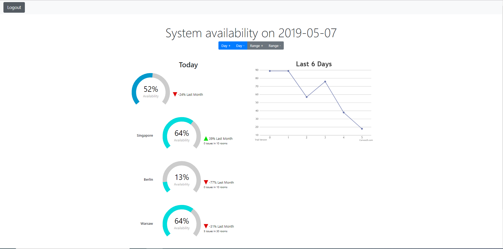

# Activity monitoring

This is a responsive web application for monitoring business data with a simple security built with Bootstrap, Spring and React. 



## Building

In order to build and test the app, type

```
mvn verify
```

## Running

You need JDK12 and Maven to run this application. In the project root directory, there is an `application.properies` configuration
file and a `dummy.csv` containing a test data source that will be used by the application if it's run from the directory. 

In order to run the application, type

```
mvn spring-boot:run
``` 

The application will be accessible via `http://localhost:8080/`.

There are three users (all identifiable by `password` password):
* `userA` - with an access to the "Today" chart
* `userB` - with an access to the "Last 6 days" chart
* `userC` - with an access to both charts